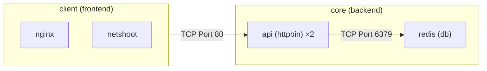

# multi-tier-multi-ns-k9s

This is my extension project for the CS-6250 Kubernetes tutorial. The existing tutorial had a single namespace which hosted the pods in which we added default-deny-all traffic and added allow rules only for the expected policies. This project extends that idea into a multi-tier multi-namespace network
which simulates actual frontend web server and backend web server

# Prerequisites

Docker is required to be installed for this project

# Architecture diagram



# Run the lab

In git bash from the repo root:

```bash
./scripts/setup.sh
```

This will setup the cluster, create the nodes, add pods in the nodes and create the services with endpoints for communication. Once this is finished, you
can start playing with the cluster

Apply zero-trust policy

```bash
./scripts/apply-zero-trust.sh
```

If you want to remove all the rules and by default allow all traffic

```bash
kubectl delete netpol --all -n core
kubectl delete netpol --all -n client
```

# Cleanup

```bash
kind delete cluster --name=multi-tier-multi-ns
```
