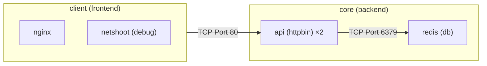

# Multi tier multi namespace kubernetes Cluster (Zero Trust)

This project extends a single-namespace Kubernetes lab into a realistic application consisting of frontend, API, and Redis tiers deployed across multiple namespaces. It demonstrates least-privilege communication using Kubernetes Cilium NetworkPolicies and verifies connectivity before and after applying Zero Trust policies.

# Prerequisites

Docker is required to be installed for this project

# Architecture diagram



# Features

- Multi-tier Kubernetes architecture
- Multiple namespaces
- ClusterIP Services
- ConfigMaps
- DNAT Mapping
- Zero Trust networking
- Cilium NetworkPolicies
- Cross Namespace DNS lookup

# Run the lab

In git bash from the repo root:

```bash
./scripts/setup.sh
```

This will setup the cluster, create the nodes, add pods in the nodes and create the services with endpoints for communication. Once this is finished, you
can start playing with the cluster

Apply zero-trust policy

```bash
./scripts/apply-zero-trust.sh
```

If you want to remove all the rules and by default allow all traffic

```bash
kubectl delete netpol --all -n core
kubectl delete netpol --all -n client
```

# Test it

After applying the zero-trust policy, connectivity matrix expectation is

| From            | To          | Port | Expected   |
| --------------- | ----------- | ---- | ---------- |
| client/web      | core/api    | 80   | ✅ pass    |
| core/api        | core/db     | 6379 | ✅ pass    |
| client/web      | core/db     | 6379 | ⛔ blocked |
| client/netshoot | core/api    | 80   | ⛔ blocked |
| any pod         | example.com | 80   | ⛔ blocked |

```bash
# web -> api
kubectl exec -n client deploy/nginx -- curl -sS api-service.core.svc.cluster.local.
# expected to see server response from httpbin

# api -> db
kubectl exec -n core deploy/httpbin -c netshoot -- nc -zv redis-service 6379
# expected to see TCP handshake done with the redis-db service
```

# Files

```

├── manifests/
│ Deployments
│
├── policies/
│ Zero Trust NetworkPolicies
│
├── scripts/
│ Cluster setup and policy application
│
└── README.md

```

# Cleanup

```bash
kind delete cluster --name=multi-tier-multi-ns
```
